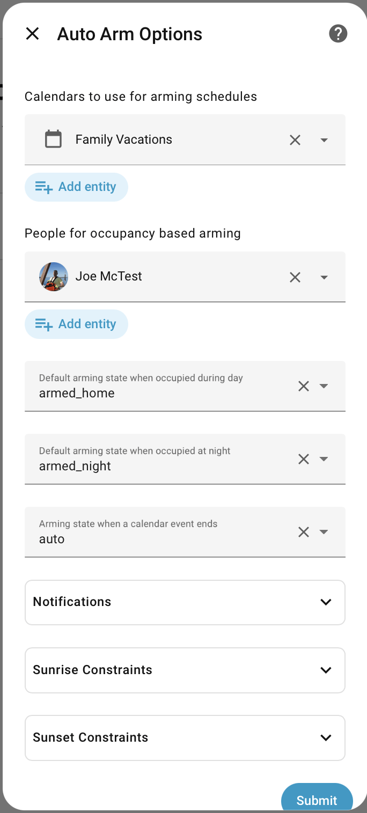
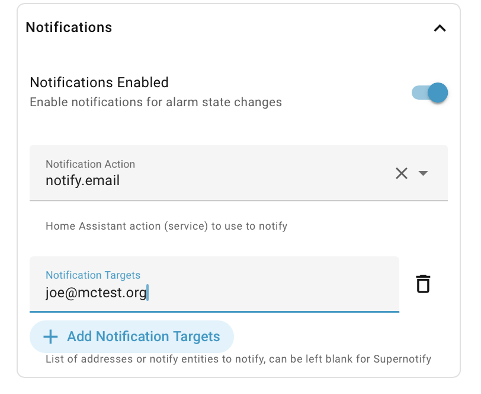

{ align=left }


# Alarm Auto Arming

[](https://github.com/rhizomatics) [![hacs][hacsbadge]][hacs]

[](https://github.com/rhizomatics/autoarm)
[](https://results.pre-commit.ci/latest/github/rhizomatics/autoarm/main)


[](https://github.com/rhizomatics/autoarm/actions/workflows/deploy.yml)
[](https://github.com/rhizomatics/autoarm/actions/workflows/github-code-scanning/codeql)
[](https://github.com/rhizomatics/autoarm/actions/workflows/dependabot/dependabot-updates)

<br/>
<br/>
<br/>


Automate the arming and disarming of the built-in Home Assistant [Alarm
Control Panel Integrations][], with additional support for calendar integration, occupancy-driven arming and disarming, manual override via remote control buttons, and mobile push actionable notifications.

Calendar, occupancy and diurnal scheduling available with **zero YAML**, everything configured from the Home Assistant settings. Advanced configuration for physical buttons, and fine-tuning for other scheduling, available from optional YAML configuration.

!!! question inline end "Why use alarm control panels?"
    A (virtual) [Manual Control Panel](https://www.home-assistant.io/integrations/manual/) is useful, even if there is no real alarm system, as a **single central state of the home**, and then use that to drive automations, notifications etc rather than littering notifications with checks for presence, time of day, vacations or similar.

    For example, it is likely that many things will change if `ARMED_VACATION` applies, and you may want to have all PIR alerts silenced if alarm state is `DISARMED`. This builds on how real alarm systems have worked for decades.

    One big obstacle to using Alarm Control Panel is having to remember to change the
    alarm panel state when people are in or out of the house, at night or when away on holiday.
    *AutoArm* solves that problem, and makes the Alarm Control Panel essential for any
    well-automated home.

## Setup

AutoArm is one of the default repositories on [HACS][], so there's no need to register  a custom repo.

Notifications will work with any HomeAssistant notification implementation, with additional support for [Supernotify](https://supernotify.rhizomatics.org.uk) for multi-channel notifications with mobile actions.

## Configuration

AutoArm is set up using the Home Assistant Integrations page, with additional advanced configuration available via YAML.

### UI Setup

1. Go to **Settings** > **Devices & Services** > **Add Integration** and search for **AutoArm**.
2. Select your **Alarm Control Panel** entity (any [Alarm Control Panel Integration][Alarm Control Panel Integrations] will work). If you don't have one, see [Create an Alarm Panel](configuration/create_panel.md).
3. Optionally select **Calendar** and **Person** entities.
4. Adjust defaults in **Options** at any time (calendar entities, person entities, occupancy defaults, no-event mode).



### YAML for Advanced Features

Transitions, buttons, notifications, diurnal settings, rate limiting, and per-calendar overrides (state patterns, poll intervals) are configured in YAML. See [Typical Configuration](configuration/examples/typical.md) for a full example.

!!! note "Migrating from YAML-only"
    Existing YAML configurations are automatically migrated to a config entry on restart. See [Migration Guide](configuration/migration.md) for details.

## Automated Arming

See [Automated Arming](automated_arming.md) for the various mechanisms, options and how to configure.

The full list of how alarm panel state can be set:

| Source        | Description                                                               |
|---------------|---------------------------------------------------------------------------|
| calendar      | Calendar events                                                           |
| mobile        | Mobile action                                                             |
| occupancy     | Occupancy calculation, e.g. automatically switching off `ARMED_AWAY`      |
| alarm_panel   | Changes made to Alarm Control Panel outside of AutoArm                    |
| button        | A physical button push                                                    |
| action        | A Home Assistant Action call (previously known as 'Service')              |
| sunrise       | HomeAssistant `sun` integration event                                     |
| sunset        | HomeAssistant `sun` integration event                                     |
| startup       | Alarm changes made as part of AutoArm startup                             |
| zombification | Home Assistant alarm panel got itself into a 'zombie' state and was reset |


## Throttling

To guard against loops, or other reasons why arming might be triggered too often,
rate limiting is applied around the arm call, limited to a set number of calls within
the past so many seconds. Configured by `rate_limit` section in config.


## Notifications

Notifications is set up via the integration settings.



Two notifications are sent:

- Alarm status has changed, by any means
- A button has been pressed, and the arm status will be actioned with a few seconds delay

### Advanced Notifications

More control over notifications is available using YAML configuration,

The alarm status message by default uses a `quiet` profile, and another one called `normal`, which can be overridden with as many profiles named as you like. Each profile is defined by the source of alarm change, optionally restricted by which alarm states are involved, and lets you change the priority, or any of the other message content (the ubiquitous Home Assistant `data` section).

```yaml
notify:
    quiet:
      scenario: nerdy
      data:
        priority: low
    normal:
      source:
        - calendar
      state:
        - armed_vacation
        - armed_away
      data:
        priority: medium
```

 If you want to send to e-mail and mobile then this will fail with a notify group unless you use very basic messages, since additional fields, like the `actions` in the `data` field for Actionable Notifications aren't supported by other notification platforms. The best way to resolve that is with [Supernotify](https://supernotify.rhizomatics.org.uk) which will tune each message for the underlying transport ( mobile apps, and also e-mail, text, chime etc.) along with lots of other tuning options and automatic discovery.

## Home Assistant Features Supported

- [Alarm Control Panel Integrations][]
- [Actionable Notifications](https://companion.home-assistant.io/docs/notifications/actionable-notifications/)
- [Calendar Integration](https://www.home-assistant.io/integrations/calendar/)
- [Sun Integration](https://www.home-assistant.io/integrations/sun/)
- [Person Integration][]
- [Button Integration][]
- [Device Tracker Integration](https://www.home-assistant.io/integrations/device_tracker/)
- [Conditions][]
- [Notifications](https://www.home-assistant.io/integrations/notify/)
- [Repairs](https://www.home-assistant.io/integrations/repairs/)
    - Raises repairs for invalid transition configurations
- [Developer Tools](https://www.home-assistant.io/docs/tools/dev-tools/)
    - Configurable integration with UI config flow and options
    - Reloadable from the *YAML* tab
    - Exposes *entities* for its configuration and last calendar event.

## References

* [Home Assistant Calendar Integration](https://www.home-assistant.io/integrations/calendar/)
* [Home Assistant Manual Control Panel docs](https://www.home-assistant.io/integrations/manual/) for more info.
* Handy [Dashboard Alarm Panel](https://www.home-assistant.io/dashboards/alarm-panel/) widget to add to your Home Assistant dashboard.

[](https://squidfunk.github.io/mkdocs-material/)

[CalendarEvent]: https://github.com/home-assistant/core/blob/56a71e6798ada65e9c99f92f64bd4168e98b935b/homeassistant/components/calendar/__init__.py#L364
[Alarm Control Panel Integrations]: https://www.home-assistant.io/integrations/?search=alarm+control+panel
[Conditions]: https://www.home-assistant.io/docs/scripts/conditions/
[HACS]: https://hacs.xyz
[Button Integration]: https://www.home-assistant.io/integrations/button/
[Person Integration]: https://www.home-assistant.io/integrations/person/


[hacs]: https://hacs.xyz
[hacsbadge]: https://img.shields.io/badge/HACS-Default-blue.svg
