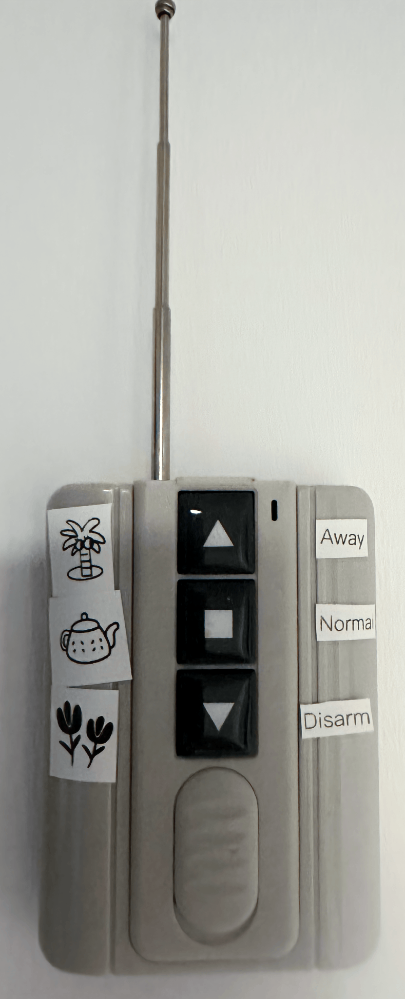
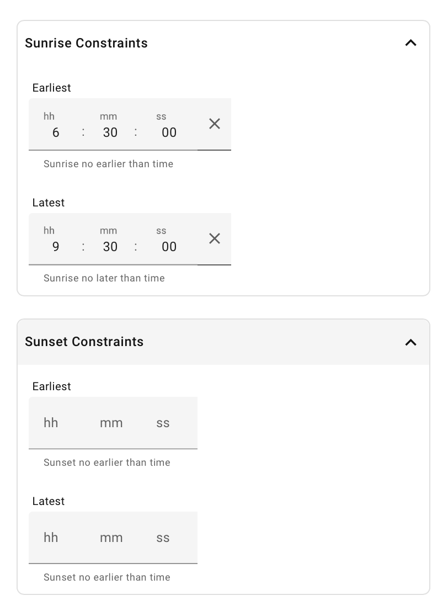

# Automated Arming

Arming has several complementary modes of operation, that can be selected and mixed as you need.

Mobile Actions, Buttons and Alarm Panel changes are classed as **Manual Interventions**, and won't be overridden
back by Auto Arm unless there's an occupancy change or other manual intervention.

## Context

Here is a quick reminder of how Home Assistant intends armed states to be used, taken from the [Alarm Control Panel Documentation](https://www.home-assistant.io/integrations/alarm_control_panel/):

| State                 | Use                                                                                                                                                      |
|-----------------------|----------------------------------------------------------------------------------------------------------------------------------------------------------|
| `armed_home`          | Perimeter protection while you are inside. Doors and windows are monitored, but interior motion sensors are ignored so you move freely around the house. |
| `armed_away`          | Full protection for when nobody is home. All sensors (perimeter and interior) are active.                                                                |
| `armed_night`         | Similar to home mode, but tuned for sleeping. Typically covers perimeter sensors and selected interior zones while leaving bedroom areas free.           |
| `armed_vacation`      | Extended away protection for longer trips. Some systems enable additional monitoring or alerts in this mode.                                             |
| `armed_custom_bypass` | rmed with one or more zones deliberately skipped. Useful when you want to leave a specific door or window open while arming the rest of the system.      |
| `disarmed`            | The alarm is off. Sensors are not being monitored.                                                                                                       |

(There are also some other ephemeral or problem states needed for dealing with real alarm systems).

## Alarm Panel Control

Auto Arm listens for changes to the Alarm Control Panel from other sources, like the Home Assistant mobile companion
app or other automations, with Auto Arm respecting the selected new state, and applying the same *Manual Intervention* controls for further state changes.

### Voice Assistants

The Home Assistant **Alarm Control Panel** can also be exposed to a Voice Assistant, so disarm or arm by talking to Alexa or similar. Use the *Settings*->*Voice Assistants* page in Home Assistant to do this.

Alexa has additional controls to prevent unauthorized disarming ( otherwise burgulars could shout
through the letterbox! ), see [Connect Your Home Security System to Echo Hub](https://www.amazon.co.uk/gp/help/customer/display.html?nodeId=T3hgRgU3Wx5DZxfZCB) on the Amazon documentation.

### Built-in Agent Sentences

!!! warning "Early Access"
    Limited to English. Feedback, and suggested wording for other languages, is welcome on
    [GitHub issues](https://github.com/rhizomatics/autoarm/issues).

Home Assistant's own [Assist](https://www.home-assistant.io/voice_control/) agent, which doesn't use AI, matches fixed sentences. Auto Arm adds these sentences, which work by voice or in the chat. Arming and explaining are on unless **Arm and explain by voice** is switched off in the **Assist** section of the Auto Arm options. Disarming is off unless **Disarm by voice** is switched on.

| Say                                  | Does                                            |
|--------------------------------------|-------------------------------------------------|
| "Arm the alarm"                      | Arms away                                       |
| "Arm the alarm in *home* mode"       | Arms *home*, *away*, *night* or *vacation*      |
| "Set the security system to *night*" | The same, "holiday" also works for vacation     |
| "Disarm the alarm"                   | Disarms, only if **Disarm by voice** is on      |
| "Why is the alarm armed?"            | Says who or what last changed it, when, and why |
| "What changed the alarm?"            | The same                                        |

"Alarm", "security system" and "burglar alarm" all work. These sentences take priority over Assist's own alarm sentences, so arming or disarming by voice goes through Auto Arm and counts as a *Manual Intervention*, like a button.

Asking why gives the time of the change and what made it, such as a calendar event, sunset, a button or someone leaving. For changes worked out from who's home and the time of day, it also says whether anyone was home and whether it was night. Changes made directly on the alarm panel are reported as such. Auto Arm only knows about changes since Home Assistant last started.

!!! danger "Disarming by voice"
    With **Disarm by voice** on, anyone who can talk to Assist can disarm the alarm, and no code is asked for. Think about who can reach your voice satellites and chat before switching this on.

## Physical Button Control

Handy if you have a Zigbee, 433Mhz or similar button panel by the door - choose one of the
[Button Integrations](https://www.home-assistant.io/integrations/?cat=button) entities
for `DISARMED`,`ARMED_AWAY` etc, or a *Reset* button to set the panel by the default algorithm.

Two kinds of entity work as buttons:

- **Button entities**, such as `button` or `input_button`, whose state is the time of the last press, so each new time is a press
- **Binary sensors**, such as a door-side remote, where turning `on` is a press, and turning back `off` is ignored

A button going `unavailable`, `unknown` or coming back online isn't treated as a press, so a remote reconnecting won't change the alarm. On/off switches, where `off` should mean something of its own, aren't supported.

A delay can be set, so if for example you have an *away* button next to the front door, you can give yourself a couple of minutes to exit the property before the alarm is set.

See also the [Manual MQTT Alarm Control Panel](https://www.home-assistant.io/integrations/manual_mqtt/)
for another way to integrate physical buttons to control state.

{width=240,align=left}
/// caption
Example Cheap 433Mhz Buttons Using RFLink
///

## Mobile Action Control

This works similar to the buttons, except its driven by [Actionable Notifications](https://companion.home-assistant.io/docs/notifications/actionable-notifications/). See [Mobile Actions](mobile_actions.md) for more information, and the [Contextual Mobile Actions Recipe](https://supernotify.rhizomatics.org.uk/recipes/contextual_mobile_actions/) for a nice way to do this in [Supernotify](https://supernotify.rhizomatics.org.uk) where only the appropriate actions are shown.

These can be added to any notification, so for example noisy PIR alerts can be quickly squelched by disarming the alarm.

## Home Assistant Action

An action (aka "service") called `autoarm.reset_state` can be used to trigger a state reset. It will work
the same way as other resets, such as at sunrise or sunset.

## Calendar Control

!!! note "Configuration split"
    Calendar entities are configured via the Auto Arm **Options** UI, and what happens when an event ends in its **Advanced** section. Per-calendar `state_patterns` and `poll_interval`, and the top-level `notify_grace_period`, remain in YAML.

### Integrating a Calendar

Use a Home Assistant [calendar integration](https://www.home-assistant.io/integrations/?cat=calendar) to
define when and how to arm the control panel. If you don't have one, follow these [instructions](configuration/create_calendar.md).

Using a [Remote Calendar](https://www.home-assistant.io/integrations/remote_calendar/), [Google Calendar](https://www.home-assistant.io/integrations/google/) or similar also means that alarm scheduling can be done remotely, even if you have no remote access to Home Assistant.

Multiple calendars, of different types, can be configured, and specific alarm states / match patterns per calendar. See the [example configuration](configuration/examples/typical.md)

### Recurring State

Armed or disarmed state can be configured with an entry for that purpose, for example a recurring entry on a [Local Calendar](https://www.home-assistant.io/integrations/local_calendar/) dedicated to Auto Arm, or looking up an existing calendar to find vacations by pattern.

If there's no calendar event live, then arming state can be worked out automatically, fixed at a default state, or left to manual control.

### When an Event Ends

The **Advanced** section of the options has separate settings for an **armed** event ending (`armed_home`,
`armed_away`, `armed_night`, `armed_vacation` or `armed_custom_bypass`) and a **disarmed** event ending, unless another event is still live. Each can be:

| Setting                           | Armed event ends                                                                                                      | Disarmed event ends                   |
|-----------------------------------|-----------------------------------------------------------------------------------------------------------------------|---------------------------------------|
| **Auto**, the default             | **By occupancy and sun** if the sunrise or sunset [trigger](#triggers) is active that day, otherwise **By occupancy** | The same                              |
| **By occupancy and sun**          | Worked out from who's home and whether it's day or night, the same as any other reset                                 | The same                              |
| **By occupancy**                  | Disarms, or arms away if everyone is out                                                                              | Arms home, or away if everyone is out |
| **Manual**                        | Goes back to the state before the event                                                                               | The same                              |
| A fixed state, such as `disarmed` | Goes to that state                                                                                                    | The same                              |

**By occupancy** ignores day and night. That matters when an event ends close to sunrise or sunset:

An `armed_night` event ending at 06:45, before the sun is up, would be worked out as still night by **By occupancy and sun** and stay armed for the night, until sunrise disarms it a few minutes later. With **By occupancy** it disarms as the event ends.

**Auto** only takes day and night into account when sunrise or sunset will re-evaluate the state that day. With the sunrise and sunset triggers left at their default of **Auto**, they're off on any day with a calendar event, so an event ending goes by occupancy alone.

In YAML, these are `auto`, `auto_sun` and `auto_occupancy` for `no_event_mode`, `armed_end_mode` and `disarmed_end_mode`.

### Other Resets When Using Calendars

Resets that don't come from an event starting or ending, such as sunrise, someone arriving or leaving, or
the reset button, work out the state like this:

1. While an event is live, a reset button or the `autoarm.reset_state` action returns to the event's state.
   Automatic resets, such as sunrise, leave it alone, along with any manual change made during the event.
2. Otherwise, if an event ended earlier today, the setting for that kind of event ending applies:
   **Manual** leaves the state alone, **Auto (occupancy)** and fixed states reset as they would at the end
   of the event, and **Auto (occupancy and diurnal)** works the state out as usual.
3. With no calendar activity today, the state is worked out as if there were no calendars.

### Notification Coalescing

Calendar changes often arrive in pairs - one event ending right as another begins, or a burst of changes
from re-matching after a calendar update. To avoid a flurry of notifications for what is really one change,
calendar-sourced notifications wait for a grace period (`notify_grace_period` in YAML, default one minute)
before sending. If another calendar-sourced change lands within that window, the wait restarts and only the
net change - from the state before the first change to the state after the last - is notified. If that nets
out to no change at all, nothing is sent.

This only debounces the *notification*; the alarm panel's actual state still updates immediately as each calendar-driven change happens.

## Time of Day Control

A [Time of Day](https://www.home-assistant.io/integrations/tod/) sensor can set an alarm state for the same period every day, without needing a recurring calendar event. For example, a **Bedtime** sensor that is on from 23:00 to 07:00 holds the alarm at `armed_night`, whatever time the sun sets or rises. See the [Recommended Recipe](configuration/examples/recommended_recipe.md) for a complete setup with sunset and a vacation calendar.

1. Create the sensor in **Settings** > **Devices & Services** > **Helpers** > **Create Helper** > **Times of the Day**, giving the times it turns on and off.
2. In **Settings** > **Devices & Services** > **Auto Arm** > **Configure**, choose it as the **Bedtime sensor for Armed Night**, or for any other alarm state, open the **Time of Day** section and choose the sensor for the state it should set. More than one sensor can be chosen for a state. There's no choice for `armed_vacation`, as a daily period doesn't suit it.

While the sensor is on:

- The alarm goes to the sensor's state when it turns on, including when Home Assistant starts part way through the period.
- Automatic resets, such as sunrise or sunset, leave the state alone, along with any manual change made meanwhile. A reset button or the `autoarm.reset_state` action returns to the sensor's state.
- If everyone is out, the alarm is `armed_away` instead, and goes to the sensor's state when someone comes home, and back to `armed_away` if they all leave again. This applies to the states chosen under **Calendar Occupancy Override** in the options, which by default is all but `armed_custom_bypass`.
- A live calendar event takes priority. The sensor turning on or off during the event changes nothing, and if the sensor is still on when the event ends, the alarm goes to the sensor's state. So there's no need to switch a bedtime sensor off for a vacation that's in the calendar.

When the sensor turns off, becomes unavailable or is removed, the period ends and the [calendar event end settings](#when-an-event-ends) decide the new state. **Auto** here always means **By occupancy**, so a bedtime ending before sunrise still disarms, or arms away if everyone is out.

Unlike a calendar event, a Time of Day sensor doesn't switch off sunrise and sunset [triggers](#triggers) that are set to **Auto**, so sunset still arms on an ordinary evening before bedtime starts.

Changes made by a Time of Day sensor have the `tod` source, for notification profiles and in the logbook, and are linked to the sensor's own state change.

## Triggers

The **Triggers** section of the options decides what can start a re-evaluation of the alarm state. It changes *when* the state is worked out, not *how*, and only covers these triggers - a reset button, the `autoarm.reset_state` action or a calendar event ending still work out the state as usual.

| Trigger                  | Choices       | Default |
|--------------------------|---------------|---------|
| **Sunrise**              | On, Off, Auto | Auto    |
| **Sunset**               | On, Off, Auto | Auto    |
| **Someone arrives home** | On, Off       | On      |
| **Someone leaves home**  | On, Off       | On      |

**Auto** switches the trigger off on any day with a matching [Calendar Control] event starting, ending or running that day, and back on for days without calendar activity. This suits a calendar that handles particular days, such as a night out or working from home, while sunrise and sunset take over on ordinary
days.

Every arrival or departure re-evaluates, not just the house becoming occupied or empty, since [Transition Conditions](#algorithm-conditions) can depend on who in particular is home. When that doesn't change the alarm state, nothing happens.

## Diurnal Control

This does three things to support [Automated Transitions]:

1. Re-evaluate the alarm state at **sunrise**
    - There's a `earliest` and `latest` cutoff option in the UI config to stop alarm being disarmed at 4am if you live far North, like Canada or Scotland.
    - The cutoffs for sunrise can be set to the same time to override the `sun` integration altogeher for sunsrise
2. Re-evaluate the alarm state at **sunset**
    - There's a `earliest` and `latest` cutoff option in the UI config, which works identically to that for sunrise
3. Provide a `day` and `night` value for conditions

Whether sunrise and sunset re-evaluate the alarm state at all is set in [Triggers]. Switching them off there doesn't change the `day` and `night` values, so these still choose between armed states whenever the
state is worked out for some other reason.



## Occupancy Control

!!! note "Configuration split"
    Person entities and occupancy `default_state` are configured via the Auto Arm **Options** UI. The `delay_time` setting remains in YAML.

The people who live at the property can be defined as [Person Integration][] entities [Person Entities]() in the `occupancy` configuration, and used to derive an `occupied` value for [Automated Transitions]. This works best with the Companion App on a mobile phone, although other [Device Tracker Integrations](https://www.home-assistant.io/integrations/?cat=device-tracker)
can work, such as a home network `device_tracker`.

!!! tip
    Since the occupied check looks for entities that have a state `home`, it doesn't have to be `person` entities, and you can add a list of `device tracker` entities.
    The advantage of Person is that you can define multiple trackers for a single individual, and they are `home` if any of the trackers are `home`, even if some of them haven't kept up.

See the [Presence Detection](https://www.home-assistant.io/getting-started/presence-detection/) guidance from Home Assistant on how to set this up, and the options for using it.

If the house is occupied, and its daytime, some people like that to be `disarmed` and others prefer `armed_home`. You can control this via [Calendar Control][] or use the `state_default` settings for day and/or night in the `occupancy` configuration.

One problem with device trackers is that they can be noisy, for example if someone tracked by phone walks out of wifi range, or reboots their device. This tends to be a problem when building occupied, since its much less likely for a device tracker to intermittenly think the device is at home. A delay timer can be set, separately for `home` and `not_home`, to smooth this out, so alarm won't reset unless someone still out a few minutes later.

In this configuration, there will be a three minute wait to make sure the device tracker stable for `home`->`not_home`, and zero delay when arriving home.

```yaml
  occupancy:
    entity_id:
      - person.house_owner
      - person.tenant
    default_state:
      day: disarmed
      night: armed_night
    delay_time:
      not_home: 180
```

Occupancy checks can override recurring calendar driven alarm states if desired. In the configuration screen, select the
alarm states for which the calendar state should be overridden. This means you can have a simple repeating `disarmed`
/ `armed_night` calendar setup but still have the alarm automatically go to `armed_away` if everyone leaves home.


## Automated Transitions

!!! note "YAML-only"
    Transition conditions are configured entirely in YAML.

If nothing else is configured ( occupancy, buttons, calendars ) then arming will still happen by the state of the sun. The rules for this, and how occupancy is used, are all defined as Home Assistant [Conditions] and can be overridden as you need.

| Diurnal State | Occupancy State | Alarm State   |
|---------------|-----------------|---------------|
| day           | occupied        | ARMED_HOME(*) |
| day           | empty           | ARMED_AWAY    |
| night         | occupied        | ARMED_NIGHT   |
| night         | occupied        | ARMED_AWAY    |

(*) This can be overridden using `state_default` in the `occupancy` configuration, for example if you prefer to have the alarm set to `disarmed` when people are home and its daylight.

Two other states, `armed_vacation` and `disarmed` can be set manually, by buttons, or calendar.

If you need more predictability, especially for high latitudes where sunrise varies wildly through the year,
set up a calendar and define exactly when you want disarming or arming to happen.

### Algorithm Conditions

The defaults below will be used if there is no transition defined ( you can override just one of them if
you prefer, and the others will remain as default, leave `conditions` empty if you really want to disable
the transition).

```yaml
autoarm:
  transitions:
    armed_home:
        - "{{ autoarm.occupied and not autoarm.night }}"
        - "{{ autoarm.computed and autoarm.occupied_daytime_state == 'armed_home'}}"
    armed_away: "{{ not autoarm.occupied and autoarm.computed}}"
    disarmed:
        - "{{ autoarm.occupied and not autoarm.night }}"
        -  "{{ autoarm.computed and autoarm.occupied_daytime_state == 'disarmed'}}"
    armed_night: "{{ autoarm.occupied and autoarm.night and autoarm.computed}}"
    armed_vacation: "{{ autoarm.vacation }}"
```

Conditions have an `autoarm` field added to the context, with these values. The examples above are all
in the [shortcut template style](https://www.home-assistant.io/docs/scripts/conditions/#template-condition-shorthand-notation), though any other style of `condition` can be used, along with other Jinja2 features and Home Assistant extras, including AND/OR/NOT logic.

| Field                      | Type            | Usage                                                    |
|----------------------------|-----------------|----------------------------------------------------------|
| daytime                    | bool            | The `sun` integration thinks it is daytime               |
| night                      | bool            | The `sun` integration thinks it is nighttime             |
| occupied                   | bool            | If any of the `person` entities have state `home`        |
| at_home                    | list[str]       | List of occupancy entities at home                       |
| not_home                   | list[str]       | List of occupancy entities not at home                   |
| manual                     | bool            | Alarm Panel is in vacation or 'custom bypass' mode       |
| computed                   | bool            | State is being computed by the algorithm                 |
| vacation                   | bool            | Shortcut for Alarm Panel state being ARMED_VACATION      |
| bypass                     | bool            | Shortcut for Alarm Panel state being ARMED_CUSTOM_BYPASS |
| disarmed                   | bool            | Shortcut for Alarm Panel state being DISARMED            |
| state                      | str             | Current alarm control panel state                        |
| calendar_event             | [CalendarEvent] | Most recent active Calendar Event                        |
| calendar_event.start       | datetime        | Event start date/time                                    |
| calendar_event.end         | datetime        | Event end date/time                                      |
| calendar_event.summary     | str             | Event summary                                            |
| calendar_event.description | str             | Event description                                        |
| calendar_event.location    | str             | Event location                                           |
| occupied_daytime_state     | str             | Default state for occupied in day time                   |

[CalendarEvent]: https://github.com/home-assistant/core/blob/56a71e6798ada65e9c99f92f64bd4168e98b935b/homeassistant/components/calendar/__init__.py#L364
[Alarm Control Panel Integrations]: https://www.home-assistant.io/integrations/?search=alarm+control+panel
[Conditions]: https://www.home-assistant.io/docs/scripts/conditions/
[HACS]: https://hacs.xyz
[Button Integration]: https://www.home-assistant.io/integrations/button/
[Person Integration]: https://www.home-assistant.io/integrations/person/
