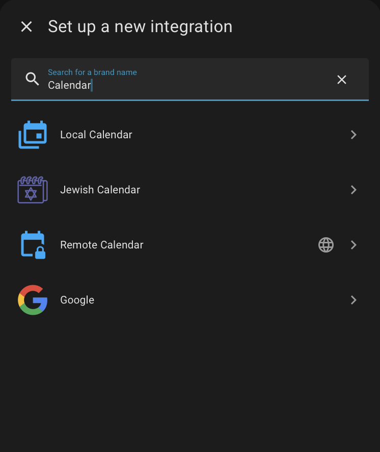
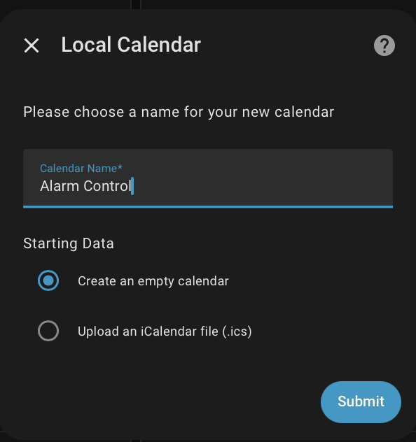
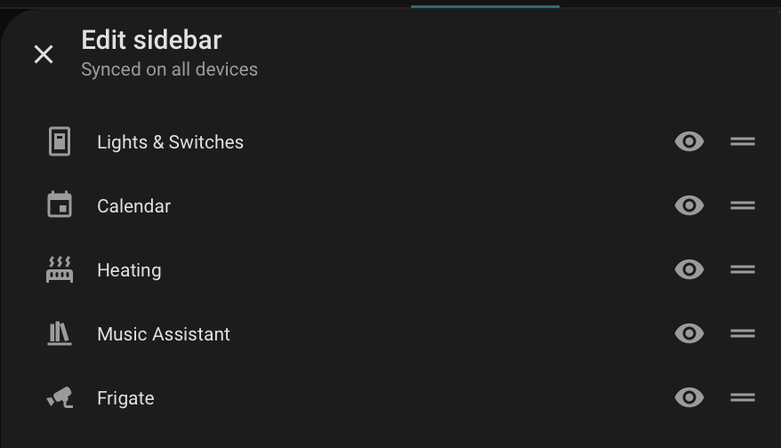
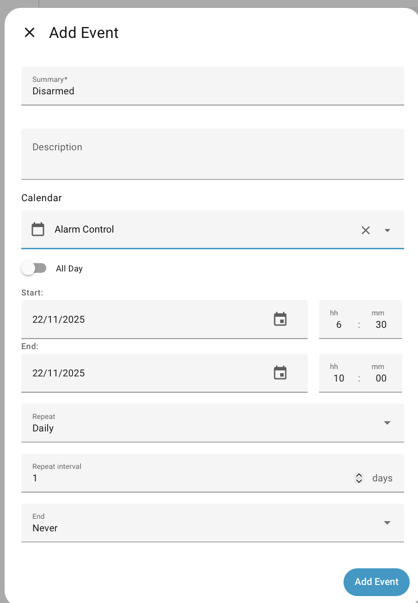

# Create a Calendar

This *How To* will show you how to create a new calendar dedicated for controlling alarm control panel state.
This is one way of using AutoArm, you can choose to use other types of calendars, reuse events from existing calendars, or mix-n-match.

## Add the Calendar Integration

1. From the *Settings* | *Integration* screen, choose **Add Integration**.
2. From this dialogue, choose **Local Calendar**

3. Configure the integration by choosing its name


## Configure AutoArm

Add the calendar to AutoArm, in this example `Alarm Control` is the name of the calendar:

```yaml
autoarm:
    calendar_control:
      - entity_id: calendar.alarm_control
        state_patterns:
            disarmed: Disarmed
```

This calendar is going to be used very simply to disarm the alarm during set periods, and let AutoArm
automatically handle the other times.

## Access the Calendar

If you don't have a **Calendar** option in the Home Assistant side-bar, then go to the personal settings ( bottom left corner, with your name against it) and change the visibility as:



## Setup a Disarm Schedule

Now that you have access to the calendar screen, add a recurring event for disarming.



## Changing your Mind

Once the event is created, double-click on a day to change it. You get the choice of changing just that
day or all the recurring entries. Similarly you can delete one day from a recurring entry without affecting all the other ones. This makes it easy to do some one-off tuning for some days.

## Adding Vacations

You may have vacation events already on another calendar integration ( like Remote or Google Calendar ),
or may want to add them to this one.

Here's how that might look:

```yaml
autoarm:
    calendar_control:
      - entity_id: calendar.alarm_control
        state_patterns:
            disarmed: Disarmed
      - entity_id: calendar.family_happenings
        state_patterns:
            armed_vacation:
              - Camping Trip.*
              - .*Holidays.*
            armed_away:
              - Work Trip.*
```
